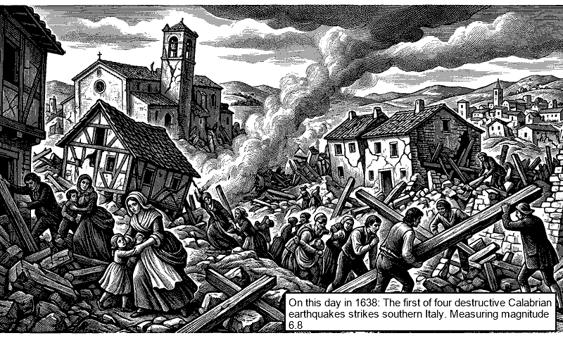

# 📅 On This Day art for TRMNL e-ink display

A daily historical event display for TRMNL e-ink displays. Fetches a significant event from [Wikipedia](https://en.wikipedia.org/wiki/Wikipedia:Selected_anniversaries) on this date in history, generates an illustration via the Gemini API, and posts it to your TRMNL display.

<table>
  <tr>
    <td></td>
    <td></td>
  </tr>
</table>

Two image styles are available, controlled by the `IMAGE_STYLE` environment variable: **Woodcut** (left) renders the scene as a vintage editorial print with dense crosshatching; **Sketch** (right) renders it as an expressive graphite pencil drawing. The default is `sketch`. See the [Environment variables](#️-environment-variables--cost) section for details.

## ⚙️ Setup

### ✅ Prerequisites

- Python 3.11+
- [uv](https://docs.astral.sh/uv/getting-started/installation/) installed
- [Gemini API key](https://aistudio.google.com/apikey)
- [TRMNL](https://trmnl.com/) device with a **[Webhook Image (Experimental)](https://help.trmnl.com/en/articles/13213669-webhook-image-experimental)** plugin configured (create this in your TRMNL dashboard and copy the Webhook URL).

### ⬇️ Installation

```bash
git clone https://github.com/yesterdayshero/on-this-day-e-ink.git
cd on-this-day-e-ink
cp .env.example .env
# Edit .env and add your GEMINI_API_KEY and TRMNL_WEBHOOK_URL (See Environment variables section below for optional configurations)
uv sync
```

### 🚀 Run

```bash
uv run python -m on_this_day
```

Executes the full pipeline: fetches events, scores them, generates the image, and pushes it to your TRMNL display.

### 🧪 Test without posting to TRMNL

```bash
uv run python -m on_this_day --no-post
```

The generated image is saved to `output/latest.png` for inspection.

### 🎯 Push a specific event manually

Edit `YEAR` and `TEXT` at the top of `run_manual_event.py`, then:

```bash
# Preview only
uv run python run_manual_event.py --no-post

# Generate and post to TRMNL
uv run python run_manual_event.py
```

Use this when you want to override the automatic selector (e.g. to push a particular event that didn't get picked, or to test a specific date). The script bypasses fetching and scoring entirely and runs the rest of the pipeline (image generation, composition, TRMNL post, Discord notification) as normal.

## 🕒 Automation

### Linux & macOS (Cron)

The ideal way to run this on Linux or macOS is via a daily cron job. 

```bash
# Open crontab
crontab -e

# Add a job to run daily at 5:30 AM
30 5 * * * cd /path/to/on-this-day-e-ink && /home/user/.local/bin/uv run python -m on_this_day >> logs/cron.log 2>&1
```
*(Note for macOS users: You may need to grant 'Full Disk Access' to `cron` or `Terminal` in System Settings > Privacy & Security).*

### Windows Task Scheduler

1. Open **Task Scheduler** → **Create Basic Task**
2. Trigger: Daily at 5:30 AM
3. Action: Start a program
   - Program: `C:\path\to\your\.cargo\bin\uv.exe` (Ensure you use the absolute path to uv.exe, otherwise the task will fail silently. You can find this path by running `where uv` in Command Prompt.)
   - Arguments: `run python -m on_this_day`
   - Start in: `<path-to-project-folder>`
4. Confirm the task runs by triggering it manually.

## 🎛️ Fine-tuning event selection

### How it works

Wikipedia publishes a list of historical events for every date. The selector filters and scores these to find the most interesting one for display. You don't need to change anything for this to work out of the box.

**The pipeline:**
1. **Fetch**: retrieves today's events from the Wikipedia "On this day" API
2. **Exclude**: removes events matching content filters (see below)
3. **Deduplicate**: collapses near-identical entries using word overlap, then a Gemini semantic check
4. **Categorise**: Gemini Flash assigns each event one or more categories
5. **Score**: category points are summed; a local relevance bonus is added for any `LOCAL_KEYWORDS` match
6. **Rank**: highest score wins; Wikipedia page count breaks ties

**Default category weights:**

| Score | Categories |
|-------|------------|
| 5 | Scientific breakthrough, transformative invention |
| 4 | Iconic first, medical breakthrough |
| 3 | Historical significance, disaster, terrorism / major attack, sport milestone |
| 2 | Political turning point, war / battle, founding of institution, political succession, cultural milestone, treaty / diplomacy, natural phenomenon |
| +2 | Local relevance bonus (any `LOCAL_KEYWORDS` match) |

**Content filters:** Events containing atrocity or safety-sensitive keywords are excluded. Birth and death events are also excluded unless the person is a globally recognised historical figure (Shakespeare, Einstein, etc.).

### Customising

If the default selection isn't to your taste, edit `src/on_this_day/selector.py`:

| Variable | What it controls |
|----------|-----------------|
| `CATEGORY_POINTS` | Score weight for each category |
| `LOCAL_KEYWORDS` | Terms that add a +2 local relevance bonus (default: `Australia`, `Australian`) |
| `GLOBAL_ICONS` | Historical figures whose birth/death events are included rather than excluded |
| `EXCLUSION_ATROCITY_KEYWORDS` / `EXCLUSION_SAFETY_KEYWORDS` | Additional content to exclude |

Use the extraction utility to test how your changes affect real data before deploying:

```bash
uv run python extract_categorised_events.py              # today's date
uv run python extract_categorised_events.py --month 3 --day 21
```

This fetches events, applies all filters and scoring, and saves the results to `output/categorised_events.json` so you can see exactly which events are in the running and why.

## 🔑 Environment variables & Cost

| Variable | Required | Purpose |
|----------|----------|---------|
| `GEMINI_API_KEY` | Yes | Paid key - for image generation (+ scoring fallback) |
| `TRMNL_WEBHOOK_URL` | Yes | TRMNL display webhook |
| `GEMINI_SCORING_API_KEY` | No | Free-tier key - used for event categorisation to save cost |
| `DISCORD_WEBHOOK_URL` | No | Daily digest + failure alerts |
| `IMAGE_STYLE` | No | Image style: `woodcut` or `sketch`. Default: `sketch` |
| `LOG_LEVEL` | No | Default: `INFO` |
| `TIMEZONE` | No | Default: `UTC` (Make sure to set this to your local timezone using [tz database format](https://en.wikipedia.org/wiki/List_of_tz_database_time_zones) so your events trigger on the correct "today"!) |

> [!NOTE] 
> **API Costs 💸:** Gemini text models (used for scoring) have a generous free tier. However, the Gemini image generation model is a paid API. Generating one daily image will incur a very small monthly cost (typically a few cents per month). To optimise costs, you can provide a secondary free-tier `GEMINI_SCORING_API_KEY` to handle the text-heavy categorisation, reserving your paid `GEMINI_API_KEY` exclusively for the single final image generation.

## 🛠️ Development

### Run tests

```bash
uv run pytest
```

### 📁 Project structure

```
├── src/on_this_day/
│   ├── __main__.py   # entry point - orchestrates the full pipeline
│   ├── config.py     # loads .env, validates required vars
│   ├── fetcher.py    # Wikipedia REST API
│   ├── selector.py   # LLM-powered event scoring (Gemini 2.5 Flash); keyword fallback
│   ├── generator.py  # Gemini image generation (3.1 Flash Image)
│   ├── composer.py   # crop → posterise → text overlay
│   ├── poster.py     # TRMNL webhook upload
│   └── discord.py    # Discord webhook notifications
├── run_manual_event.py          # Utility: Push a specific event
├── extract_categorised_events.py # Utility: Test event selection & scoring
├── pyproject.toml               # uv project definitions
└── .env.example
```

## 📜 Logs

Rotating daily logs in `logs/app.log`. 30 days retained.

## 🖼️ Output

The last generated image is saved to `output/latest.png` for inspection. 

Image style samples are available in the [samples/](samples/) folder.

Designed and tested on the original TRMNL (800×480, 2-bit greyscale); newer models will work but may support higher resolution images than this project generates.

## 🚑 Troubleshooting

- **Check the logs:** If something goes wrong, your first step should always be checking `logs/app.log`.
- **TRMNL Webhook Errors:**
  - `422 Unprocessable Entity`: Your image might be too large (over 5 MB), the wrong format, or corrupted. Try dropping it to a simple PNG.
  - `429 Too Many Requests`: You've hit the TRMNL rate limit (12 uploads per hour). Wait a bit before sending more.
- **Image pushes but display doesn't update:**
  - Check that your POST request returned a `200` response. You can also try the "Force Refresh" button in the plugin settings.
  - **Pro-tip:** In the TRMNL webhook plugin settings on the dashboard, try enabling **"Skip Device Validation"** if your image isn't rendering.
  - **Pro-tip:** For the best visual result, choose **"Contain"** for the image scaling option in the TRMNL plugin settings so the full image is shown.

## 📄 Licence

This project is licensed under the [Creative Commons Attribution-NonCommercial 4.0 International License (CC BY-NC 4.0)](LICENSE).
